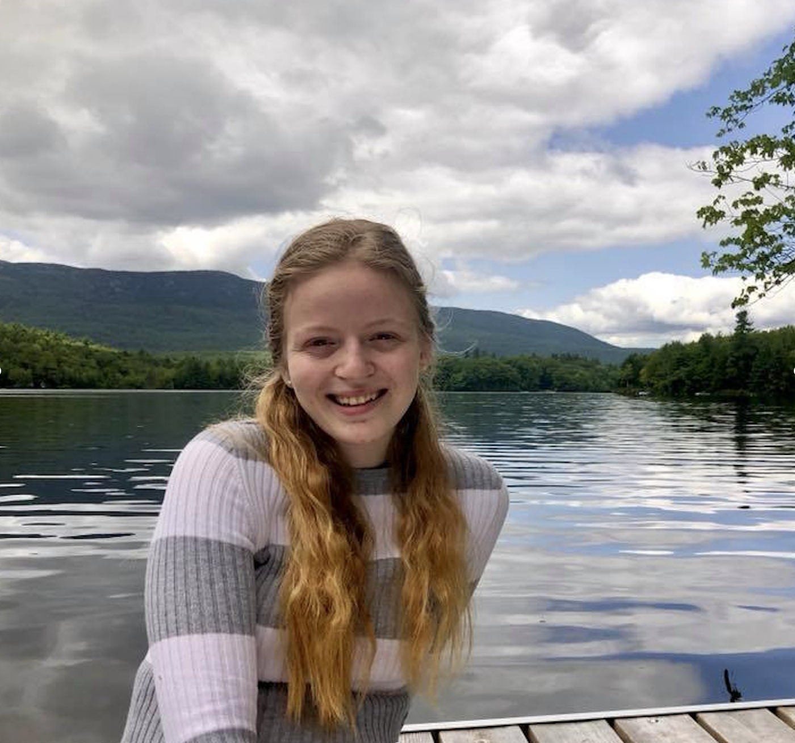

   

## Education 
 I have received my BS in Biology and Quantitative Science with Informatics from [Emory University](https://www.emory.edu/home/index.html) in 2020. I am currently working towards my MS in Biostatistics from the [Columbia Mailman School of Public Health](https://www.publichealth.columbia.edu/).
 
## Work Experience 
I have primary worked within the data science space, particularly in data engineering and data visualization. During my years as a data consultant I worked on projects like building out data pipelines, generating novel client facing dashboards and advising on data architecture strategy You can take a look at my full resume [HERE](resume.html).

## About
When I am not working I love to read, knit, and spend time with my cat, Luci. 
